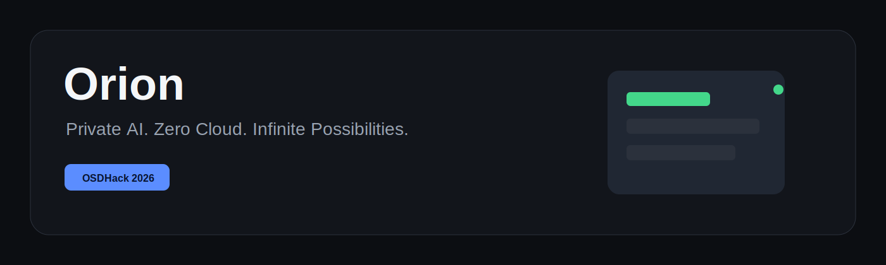

# Orion

**Private AI. Zero Cloud. Infinite Possibilities.**

Orion is a premium offline-first AI assistant built for **OSDHack 2026 | On Device AI**. It runs local WebLLM-compatible models in the browser, stores chats and documents in IndexedDB, works as an installable PWA, and keeps the user&apos;s prompts, files, settings, and history on the device.



## Why Orion

Most AI assistants depend on remote inference. Orion proves a different product boundary: the assistant, model runtime, document intelligence, cache, and settings live inside the browser. Once the app shell and model assets are cached, Orion can continue operating offline.

## Highlights

- Browser-native local inference with `@mlc-ai/web-llm`
- Worker-isolated model generation and document parsing
- Local chats, documents, settings, and model metadata with Dexie/IndexedDB
- Installable PWA with manifest, service worker, offline route, cache controls, and update handling
- Document upload, parsing, chunking, preview, search, and document chat
- Settings center for AI, appearance, accessibility, storage, privacy, and PWA controls
- Browser capability detection for WebGPU, WASM, service workers, IndexedDB, notifications, storage, and memory
- Performance dashboard for FPS, memory, storage, cache, latency, and tokens per second
- No telemetry, analytics, authentication, cloud sync, or cloud AI provider

## Tech Stack

Next.js App Router, React, TypeScript, Tailwind CSS v4, Framer Motion, Lucide, Dexie, IndexedDB, Web Workers, WebLLM, WebGPU, Service Workers, and browser Cache Storage.

## Quick Start

```bash
npm install
npm run dev
```

Open `http://localhost:3000`.

## Production Build

```bash
npm run typecheck
npm run lint
npm run build
npm run start
```

For production PWA testing, use the built app from `npm run start` and open it in a Chromium-based browser over `localhost` or HTTPS.

## Demo Flow

1. Open the landing page and explain the zero-cloud promise.
2. Install Orion as a PWA.
3. Open Models and download a local AI model.
4. Start Chat and generate a response.
5. Disconnect the network and continue using cached app routes.
6. Upload a PDF or document.
7. Ask questions about the document.
8. Show conversation history and local settings.
9. Open Privacy and PWA settings.
10. Open Performance and show offline/cache/browser status.
11. Close with: **Private AI. Zero Cloud. Infinite Possibilities.**

## Privacy Boundary

Orion does not configure OpenAI, Gemini, Claude, Grok, Cohere, Hugging Face Inference API, Together AI, Fireworks, Replicate, or any other cloud inference provider. The generation path is WebLLM in a browser worker.

## Documentation

- [Architecture](docs/ARCHITECTURE.md)
- [Folder Structure](docs/FOLDER_STRUCTURE.md)
- [Installation](docs/INSTALLATION.md)
- [Development](docs/DEVELOPMENT.md)
- [Deployment](docs/DEPLOYMENT.md)
- [Offline Usage](docs/OFFLINE_USAGE.md)
- [Model Management](docs/MODEL_MANAGEMENT.md)
- [Troubleshooting](docs/TROUBLESHOOTING.md)
- [FAQ](docs/FAQ.md)
- [Hackathon Submission](docs/HACKATHON.md)

## License

MIT. See [LICENSE](LICENSE).
