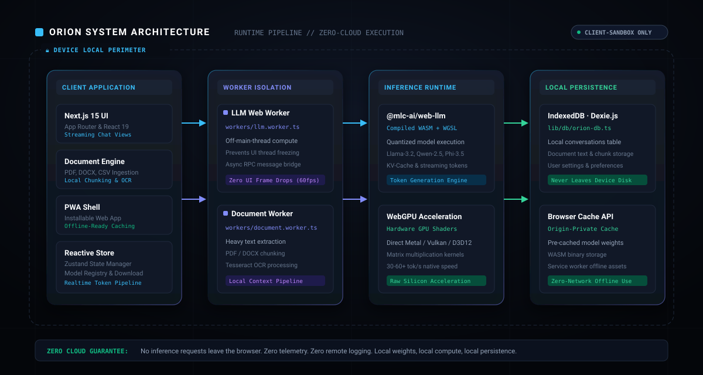
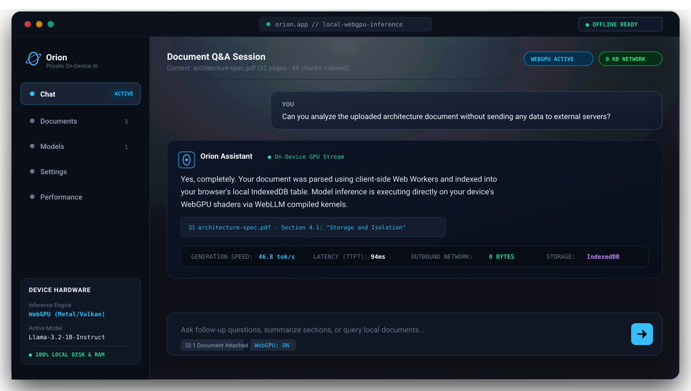

<div align="center">

# Orion

**Private AI. Zero Cloud.**

<br>

<a href="https://github.com/santheesh73/Orion">
  
</a>

<br>

On-device intelligence, running entirely in your browser.

<br>

`WEBLLM` &nbsp;·&nbsp; `WEBGPU` &nbsp;·&nbsp; `INDEXEDDB` &nbsp;·&nbsp; `PWA`

<br>

---

<br>

### Intelligence that stays local.

Orion runs AI models directly in your browser. Your conversations, documents, settings, and model data stay on your device.

<br>

---

<br>

### Under the hood

<br>



<br>

WebLLM + WebGPU handle local inference while IndexedDB and browser storage keep the experience on-device.

<br>

---

<br>

### Orion in action

<br>



<br>

---

<br>

### Capabilities

</div>

| | |
| :--- | :--- |
| **Local inference**<br>Models run directly in the browser via WebGPU acceleration. | **Offline-first**<br>Continue using Orion without a cloud backend or active connection. |
| **Local memory**<br>Chats, documents, and settings persist securely in IndexedDB. | **Document intelligence**<br>Upload, parse, chunk, search, and chat with local files. |
| **Worker isolation**<br>Generation and parsing run off the main thread for smooth UI. | **Zero telemetry**<br>No cloud inference, no analytics, and zero external tracking. |

<br>

<div align="center">

---

<br>

### Built with

<br>

[](https://nextjs.org/)
[](https://react.dev/)
[](https://www.typescriptlang.org/)
[](https://tailwindcss.com/)
[](https://webllm.mlc.ai/)
[](https://www.w3.org/TR/webgpu/)
[](https://dexie.org/)
[](https://developer.mozilla.org/en-US/docs/Web/API/Web_Workers_API)
[](https://web.dev/explore/progressive-web-apps)

<br>

---

<br>

### Your data stays yours.

No cloud inference. No telemetry. No cloud sync. Orion keeps its core AI experience inside the browser.

<br>

---

<br>

### Run locally

</div>

```bash
npm install
npm run dev
```

Open [http://localhost:3000](http://localhost:3000)

For production build and PWA validation instructions, see [docs/INSTALLATION.md](docs/INSTALLATION.md).

<br>

<div align="center">

---

<br>

Documentation: [Architecture](docs/ARCHITECTURE.md) · [Installation](docs/INSTALLATION.md) · [Development](docs/DEVELOPMENT.md) · [Deployment](docs/DEPLOYMENT.md) · [Offline Usage](docs/OFFLINE_USAGE.md) · [Model Management](docs/MODEL_MANAGEMENT.md) · [FAQ](docs/FAQ.md)

<br>

---

<br>

**Orion**  
Private AI. Zero Cloud.

MIT License · Built by [Santheesh S](https://github.com/santheesh73)

</div>
