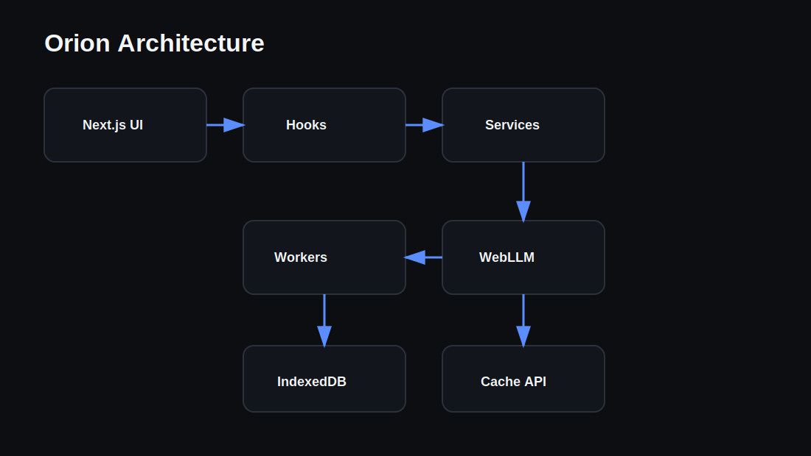
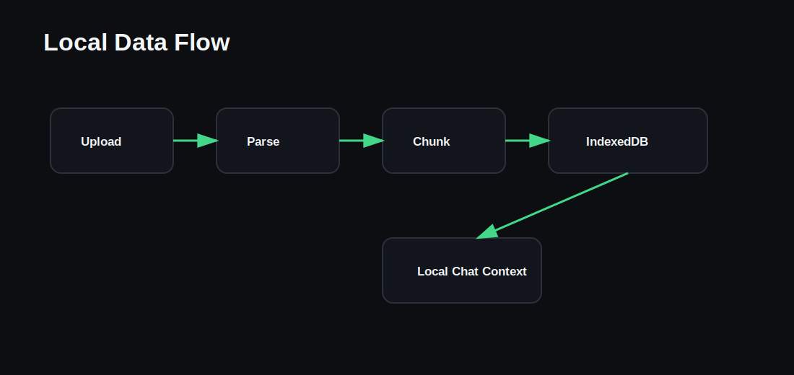
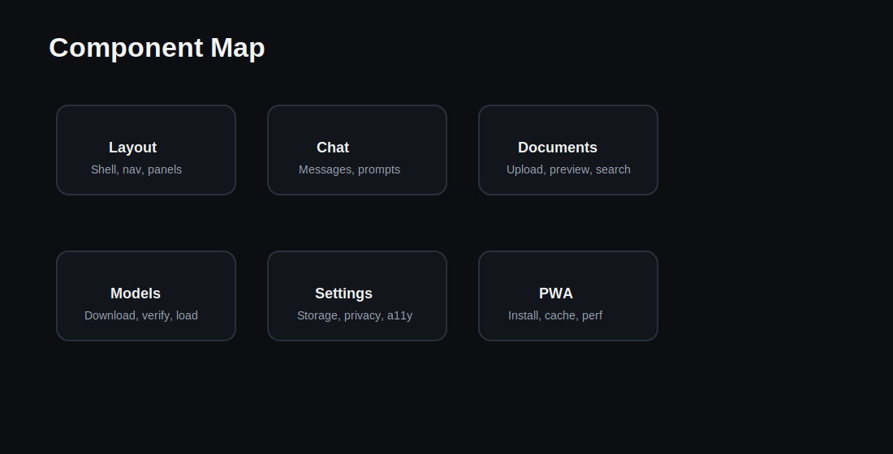

# Architecture

Orion is a browser-native Next.js application. It has no inference backend and no cloud AI provider.

## System Diagram

## Layers

- `app/`: route surfaces, metadata, loading, and error boundaries.
- `components/`: reusable layout, UI primitives, PWA surfaces, and document/model components.
- `features/`: domain-specific chat and AI UI logic.
- `hooks/`: browser-facing React hooks for AI, documents, PWA, cache, performance, network, and settings.
- `services/`: application services for AI, documents, storage, PWA, browser capability, network, and performance.
- `repositories/`: persistence access for conversations, messages, models, and settings.
- `lib/db/`: Dexie schema and IndexedDB connection.
- `workers/`: LLM and document workers for expensive work off the main thread.

## Local Inference Flow

1. The chat UI calls the local AI client.
2. The client posts work to `workers/llm.worker.ts`.
3. The worker loads `@mlc-ai/web-llm`.
4. WebLLM uses WebGPU or WASM capabilities exposed by the browser.
5. Tokens stream back to React.
6. Messages persist to IndexedDB.

## Document Flow

Documents are parsed locally, chunked, stored in IndexedDB, searched locally, and used as local context for chat. Large parsing work is routed through the document worker where possible.

## PWA Flow

The app uses `public/sw.js` for app-shell caching, static caching, image caching, navigation fallback, version cleanup, and offline recovery. `next-pwa` remains available behind `ORION_ENABLE_NEXT_PWA=1`, but the default service worker is manual because it is stable with the current Next.js build.

## Component Map

